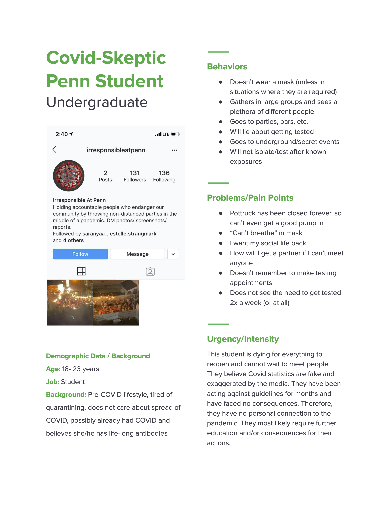
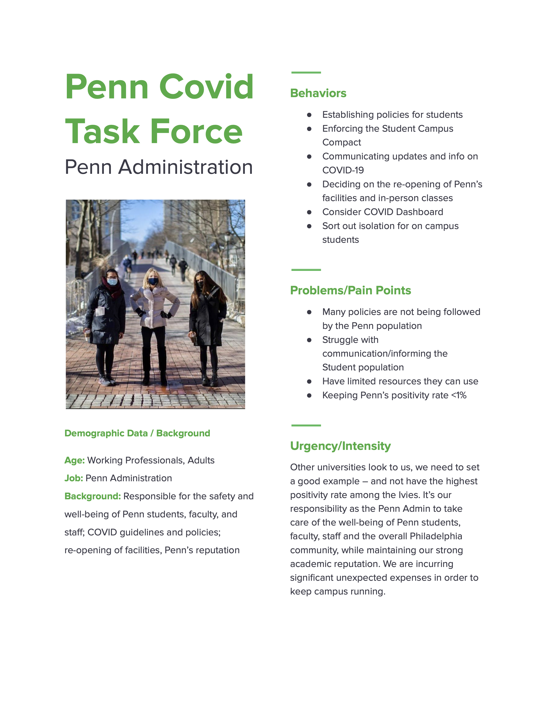
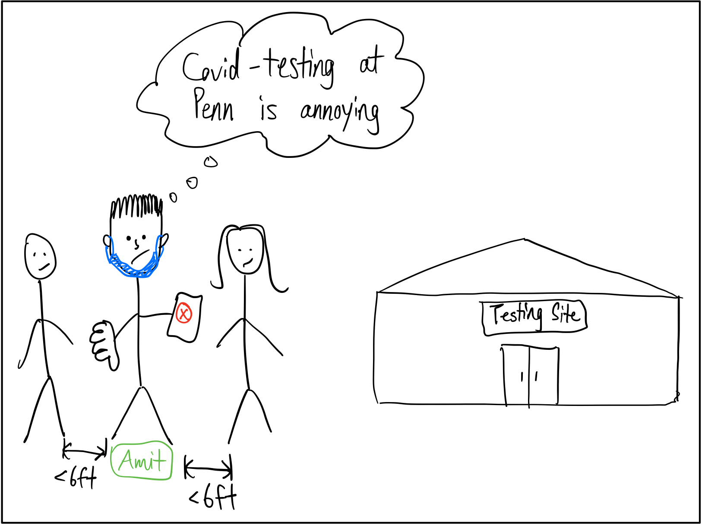
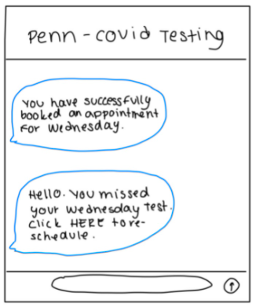
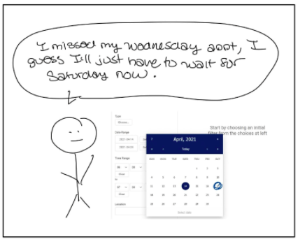
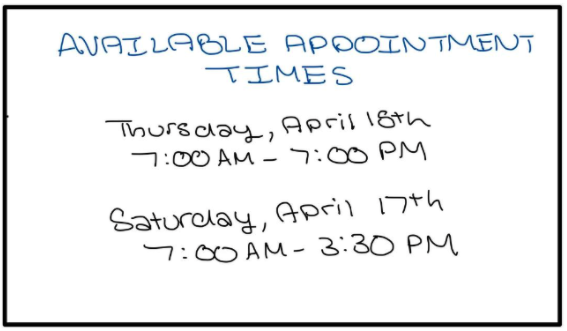
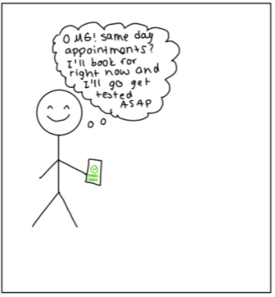
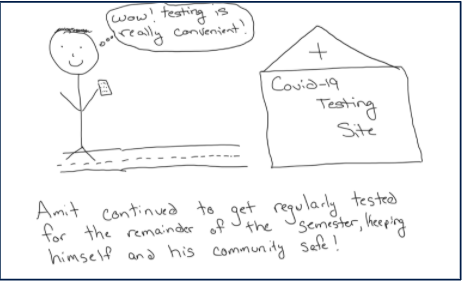
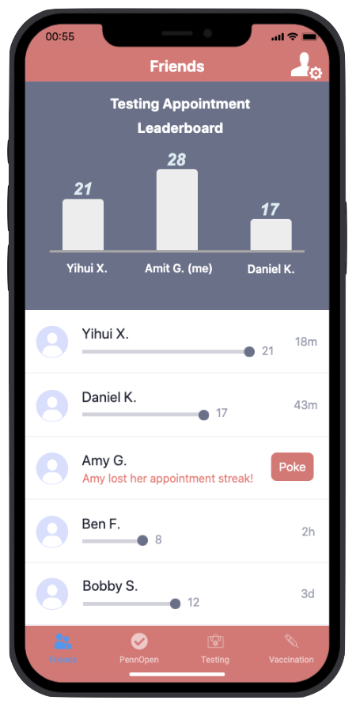

# Problem Statement

Our decision problem focuses on how we can improve COVID-testing policies at Penn to get 100% of the student body tested twice a week. Not all students fully participate in testing at Penn despite it being available for free, and we wanted to find out why. This is important because Penn's COVID recovery directly impacts the local Philadelphia community both health-wise and economically, and proper adherence to COVID-testing is key to opening campus back up safely.

# User Personas

### Persona 1 

### Persona 2

### Persona 3

# Conversation Starters

1. How often do you get tested?
2. How would you rate the testing appointment scheduling experience in terms of usability?
3. Do you think the consequences for violating Penn's Covid Student Campus Compact are too light? Too severe?
4. How often do you complete PennOpen Pass and why?
5. Have you ever tested positive for COVID? 

# User Interviews

### Interview 1 COVID-Aware Penn Junior

- 3/31/2021
- The interview took place over zoom.

#### Insights

- Activities
    + In the past, had a lot of activities and in-person things to do 
    + This year shrunk total people he saw and met
    + It is hard to connect with people on Zoom 
* COVID
    + Had a lot of COVID scares as he lives off campus in a house with seven people
    + Wants to be safe
* Testing Habits
    + Likes the relief of getting negative tests 
    + Never has missed a test 
    + Could get tested more if he could
    + Wishes that other people get tested more
    + Signs up for both appointments at once the week before, making it a part of his daily schedule, daily habit
    + Tries to go to appointments with roommates 
    + Only uses Penn Open Pass for testing days
* Testing at Penn
    + Finds it hard to remember to schedule appointment 24 hours before
    + Finds scheduling not convenient as it does not allow for walks in testing and he can only get tested on two specific days

### Interview 2 COVID-Skeptic Penn Sophomore

- 3/30/2021
- The interview took place over zoom

#### Insights

* Activities
    + He was at home for a very long time in quarantine and came back to Penn because at Penn he didn't have to care for his parents
    + Lives off campus
    + Went to parties, gatherings
* COVID
    + He was exposed multiple times and never got it
    + When he was exposed he would go to Irvine immediately with a Red Open Pass
    + Believes vaccinated people should not have the pressure to get tested
* Testing Habits
    + Rarely got tested once a week
    + Has not been tested since getting the vaccine
    + Only completes Penn Open Pass on days he would get tested
* Testing at Penn
    + Would like more walk in testing
    + Would like the registration process to be easier
    + Would forget and be too lazy to go get tested before he got the vaccine
    
### Interview 3 COVID-Aware Penn Senior

- 3/29/2021
- The interview took place over zoom

#### Insights

* Activities
    + Follows COVID rules and does not see that many friends 
    + Has significantly reduced her social life, attends few gatherings
    + Sometimes hard to follow Penn's COVID rules
* COVID
    + Her motivation to get tested is to prevent risking other people like her dad that have a higher risk
    +  Does not want to quarantine two weeks so she gets tested
* Testing Habits
    + Gets tested twice a week regularly
    + Completes Penn Open Pass daily as her needs it in order to access dorm
    + Has the vaccine and still gets tested
* Testing at Penn
    + Would like more testing days rather than just Wednesdays and Saturdays

    
### Interview 4 Penn Admin
* We reached out to a few people in the Penn Administration
* One of them responded, but said they were too busy to be interviewed
* Did not refer us to someone else

# Learnings from the User Interviews

### Learning 1

* Even though he wants to stay safe and never misses a test, Penn Open Pass is only used when he has to go test
* There is a difference between living on campus and off campus that should be addressed
* Signing up takes mental effort and sometimes he forgets, but he tries to sign up for both tests at once to reduce that mental effort
* Roommates influence his decisions! They go testing together
* We tweaked the fact that even though the COVID-Aware Student cares, they do not follow the Penn Student Compact as strictly as we though
* Sometimes only gets tested once a week

### Learning 2 

* A lot of COVID-Skeptic Students live off campus as they do not need to get tested regularly in order to maintain a green open pass
* Having the vaccine affects if this student gets tested or not
* Only completes Penn open pass to get tested
* These type of students do not necessarily go to secret events, they just join in larger gatherings
* We also tweaked the fact that this student might test if exposed

### Learning 3

* This was another COVID-Aware student but slight differences in behavior came forward
* As she lives on campus, she continued to get tested even after getting the vaccine
* We learned that the majority of on campus students continue to get tested regularly differing from off campus
* We also learned that there are not a lot of COVID-Skeptic Students, its just the system of scheduling preventing them from getting tested

### Learning 4
* We really wanted a broad sense of the community, so our team interviewed  30 people
* This resulted in learning that there are not a lot of skeptics in the student body and the students want to be safe
* We also realized that there is a minimum of fear by being disciplined by Penn
* The students that we believed to be COVID-Skeptics just actively forgot to sign up before as they may have a busy day and it requires mental effort

# Storyboarding a Solution

## Frame 1

In the first frame start with the user and their basic situation/problem before experiencing your solution. 
- Amit is a junior at Penn who wants to be COVID-safe but forgets to get tested regularly.
- He tries his best to follow COVID regulations according to Penn’s campus compact, but finds that it’s difficult to manage classes, a social life, and his mental health with pandemic safety.
- He understands the importance of testing but  but finds the restrictions around scheduling an appointment complicated and too annoying.

## Frame 2

In this second frame, we show how Amit forgot his Wednesday appointment.
- Luckily, with our new solution implemented, he got a text reminder that lets him know that he missed his appointment
- This text reminder also gives him an easy linke to reschedule
- Amit thinks he still has to wait until Saturday for his next appointment per Penn's initial covid testing schedule for undergraduates.

## Frame 3

- Amit still thinks that he will have to wait until Saturday to get tested per Penn's COVID testing schedule for undergraduates

## Frame 4

- Amit realizes Penn has changed their policies with one of our solutions: next day testing
- No need to wait half a week in the case of a missed appointment

## Frame 5

- Amit is very excited of how easy it is to get tested now with this new policy and decides to reschedule ASAP.

## Frame 6 (final frame)

Amit goes to get tested the very next day keeping himself and the rest of campus safer.
- With all the new policies which make testing more accesible, Amit continues to get tested regularly for the rest of the semester.

# Next Steps

What are your next steps if you pursue the project further

If we pursue the project further, the next step would be to reach back out to the Penn Covid Task Force and ask for a sit-down with them to understand the challenges they face as well as to potentially propose a few of our solutions.

To go a step further, we thought of building an all-in-one app that keeps track of everything COVID-related: testing appointments, results, open pass, and eventually COVID vaccination records. Additionally, we can incorporate a gameified and social component within the app in order to incentivize students to get tested regularly.

